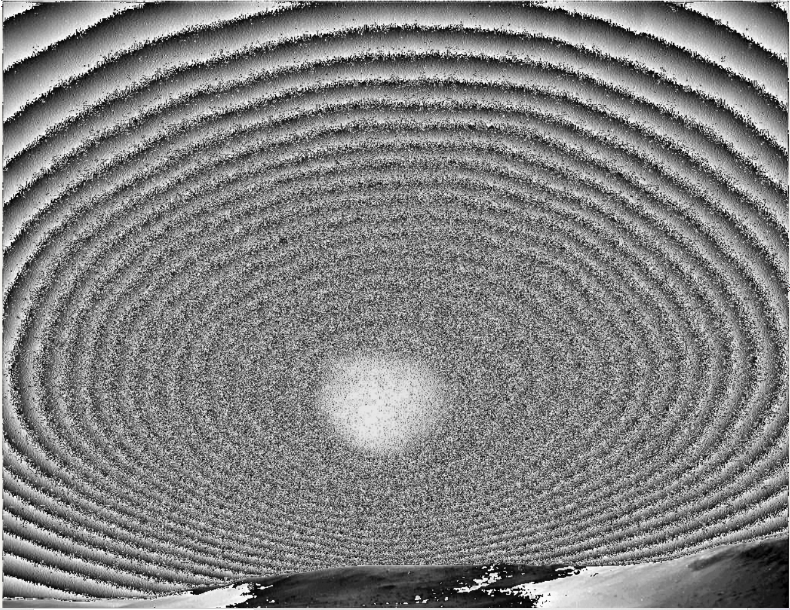
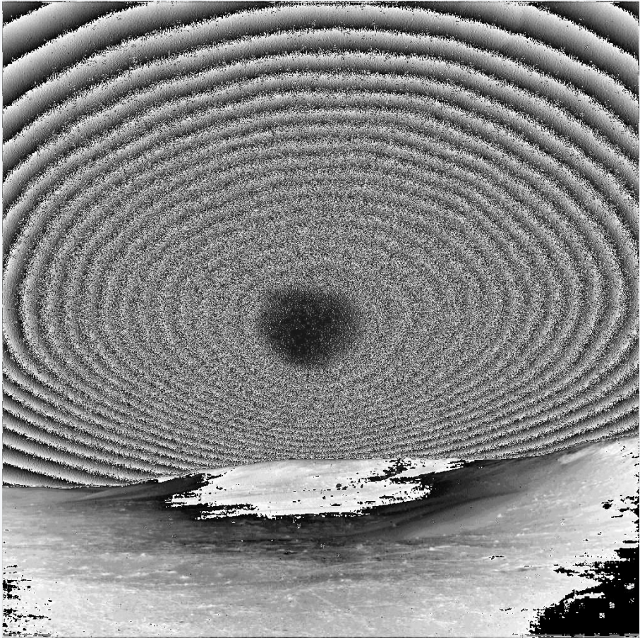
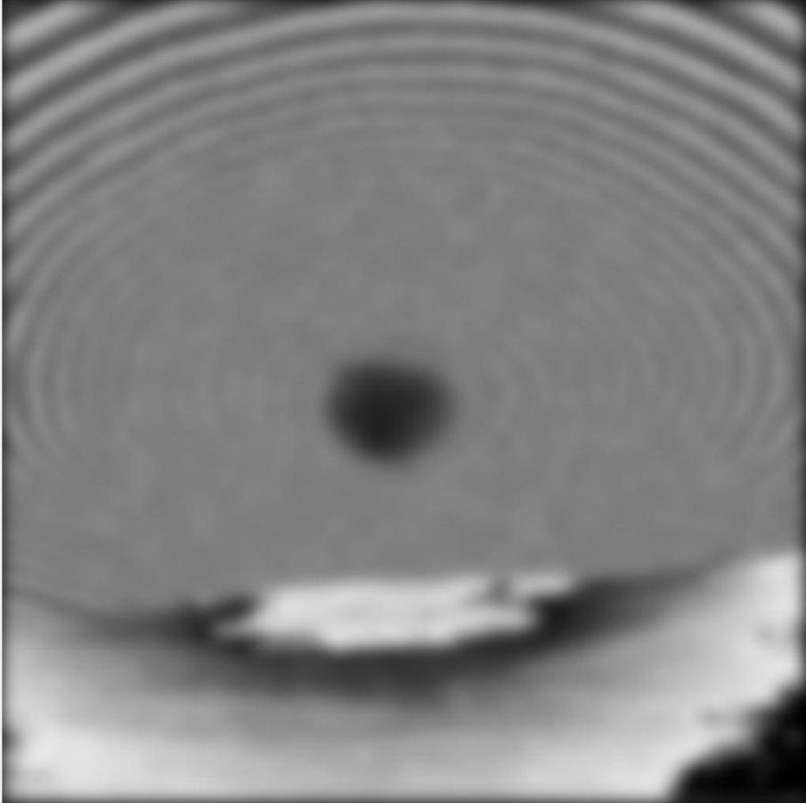
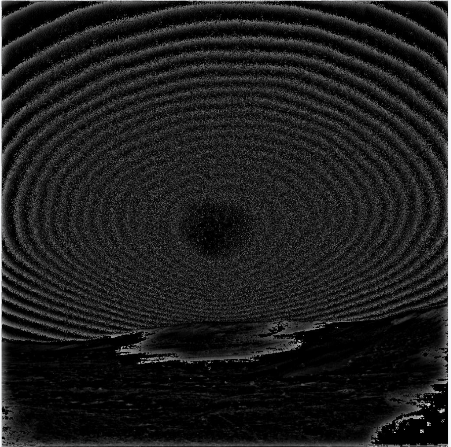
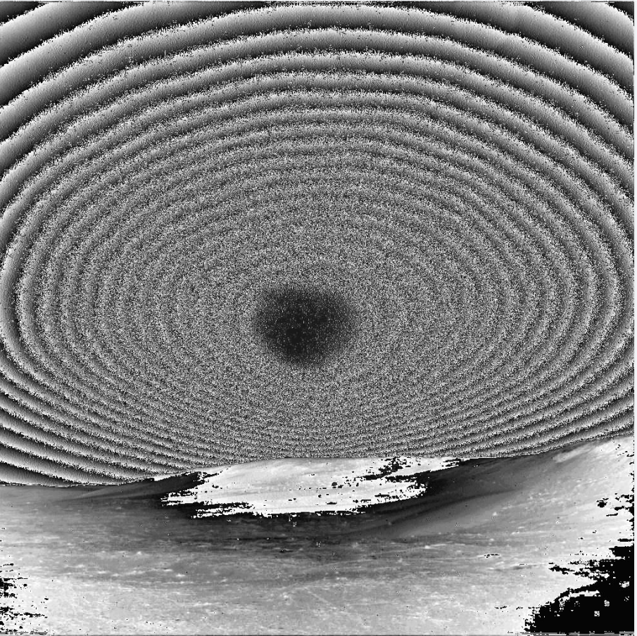
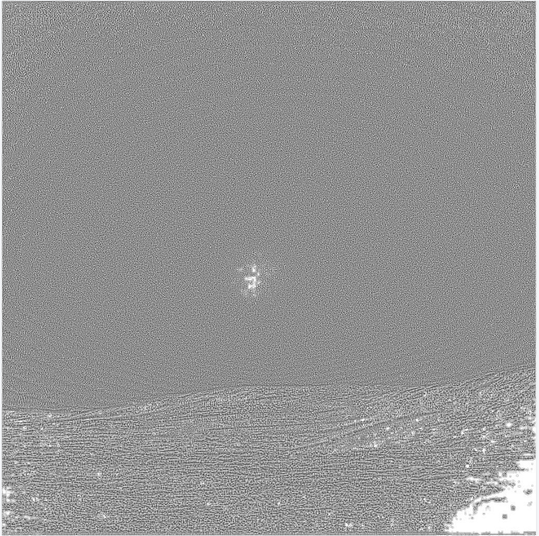

## **First step**

Add all the pictures together and average them

## Second step

Subtract the average from each picture

## Third step

 do Laplace, Gaussian lowpass filter, Gaussian high-pass filter, histogram equalization and local histogram equalization for subtracted images.

**Average image**:

**image1**:

<b>Fig.1 original image subtract average image 

<b>Fig.2 substracted 1 processed by Laplace_operator 

<b>Fig.3 substracted 1 processed processed by Gaussian_lowpass_filter 

<b>Fig.4 substracted 1 processed processed by Gaussian_highpass_filter 

<b>Fig.5 substracted 1 processed processed by histogram equalization 

<b>Fig.5 substracted 1 processed processed by local histogram equalization 

Other processed images are contained in the zip file. I won't put them in the report.