<h1 align = "center">Lab3 Hearing and Speech Perception</h1>

<center>张旭东 12011923</center>

## 1. Introduction

​	In this lab, the main task is to analyze the problem from the perspective of hearing. Although many models have been established to simulate all aspects of hearing, there are still many subjectivity in hearing. In this experiment, we will use the existing models to explain some viewpoints of hearing to a certain extent, and do practical simulation and analysis.

## 2. Lab result and analysis

### 2.1 problem1

​	The purpose of problem1 is to synthesize vowels using pure tones. We are asked to sample the spectral envelopes of vowels `a`, `i` and `u` in last lab and use pure tones to synthesize these vowels with $F0$ $150$ Hz and $250$ Hz for male and female voice. 

​	The spectral envelopes of vowels `a`, `i` and `u` are as shown in `Fig 1`.

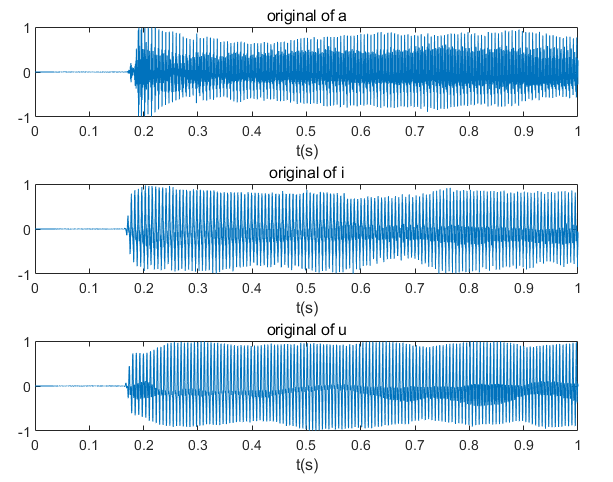

<div align = 'center'><b>Fig.1 the spectral envelopes of vowels a, i, u</div>

​	Then we do the synthesize for vowels. Our main idea is to do sampling in frequency spectral with interval $150$ Hz  and $250$ Hz. The code is as below:

```matlab
a_f=fftshift(fft(a));
na=length(a_f);
Malea=zeros(1,na/2);
Malea(150:150:na/2)=a_f(na/2+150:150:na);
Malea_f=[flip(Malea),Malea];
Malea_t=abs(ifft(ifftshift(Malea_f)));
Femalea=zeros(1,na/2);
Femalea(250:250:na/2)=a_f(na/2+250:250:na);
Femalea_f=[flip(Femalea),Femalea];
Femalea_t=abs(ifft(ifftshift(Femalea_f)));
```

​	It must be cared that the index of the spectral generated by $fft$ starts from $0$ Hz, not be symmetric about $0$ Hz. Because of that, the function $fftshift$ is used to let the spectral is symmetric about $0$ Hz. After that, merge operation is done and functions $iffshift$ and $ifft$ are used to generate the time domain signal. 

<center class="half">    
    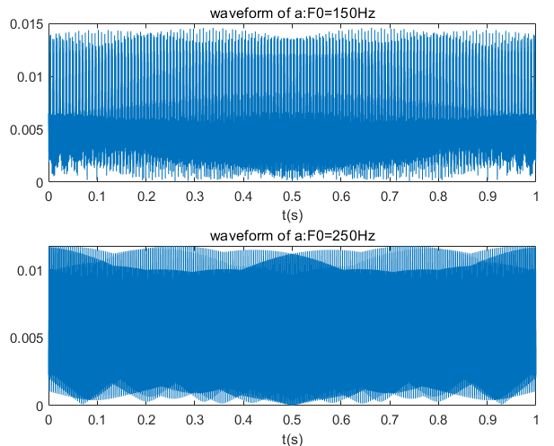    
    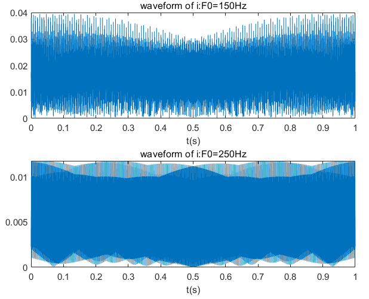 
</center

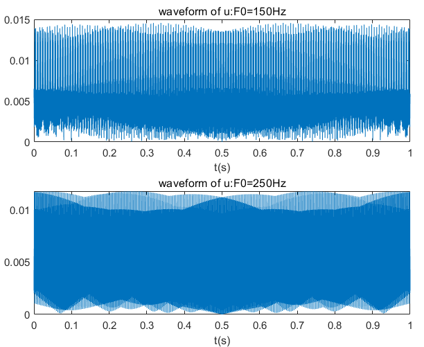

<div align = 'center'><b>Fig.2 the waveforms of the 3 synthesized vowels</div>

<center class="half">    
    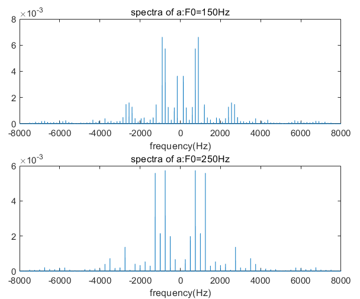    
    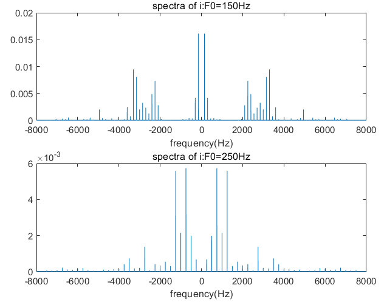 
</center

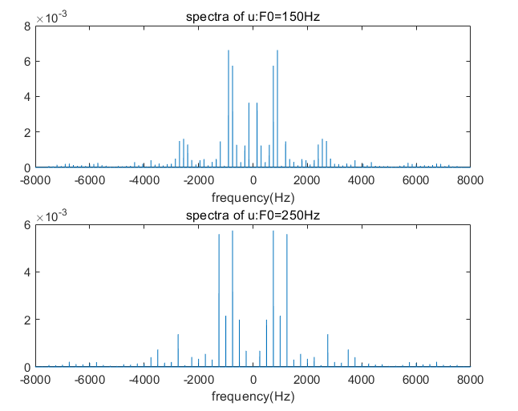

<div align = 'center'><b>Fig.3 the spectra of the 3 synthesized vowels</div>

​	Compared with the original signal, it is obvious that some peaks of the original spectra have not been picked during the process of sampling. And different vowels have different distribution of peaks. Besides, the interval for $250$Hz is obviously larger than $150$Hz.  

​	From hearing the generated signal, what  can be told is that the vowels and the speech for $250$ Hz is sharper than $150$ Hz, implying the tone for females is higher than male. It can be seen that these synthesized waveforms are very regular, which indicates the process of converting the collected spectra into the time domain is the process of superposition of sine waves.

​	The spectrograms of the $3$ synthesized vowels are plotted using function `spectrogram` ,which are as shown in `Fig 4`.

<center class="half">    
    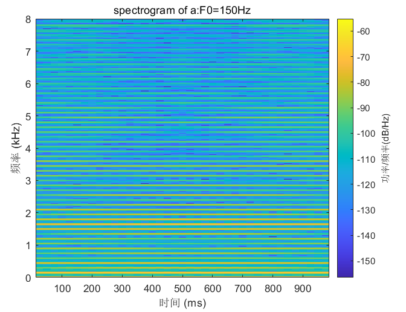    
    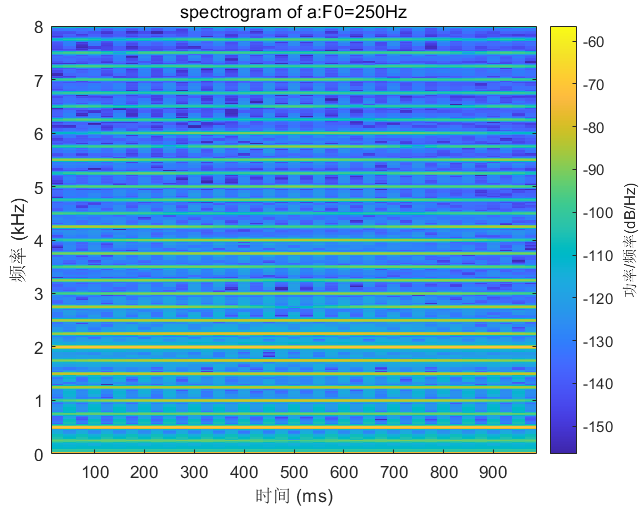 
</center

<center class="half">    
    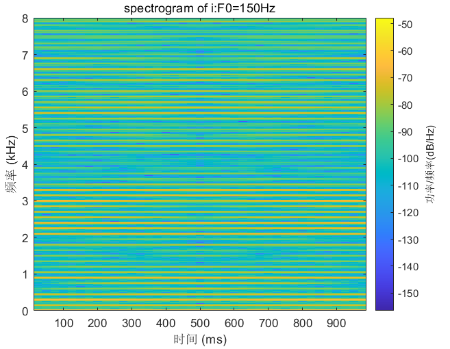    
    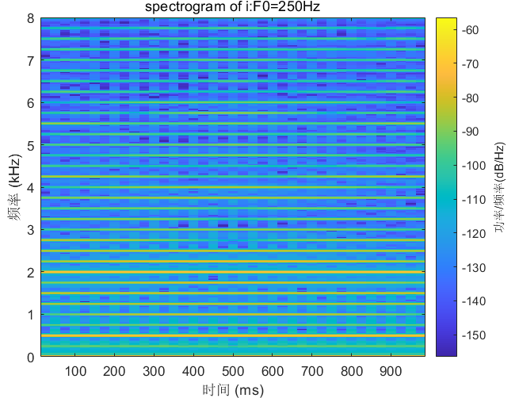 
</center

<center class="half">    
    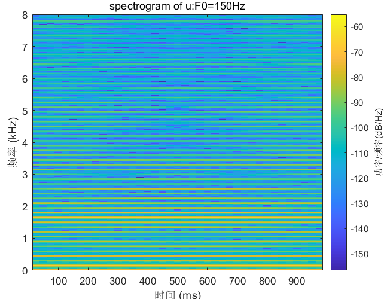    
    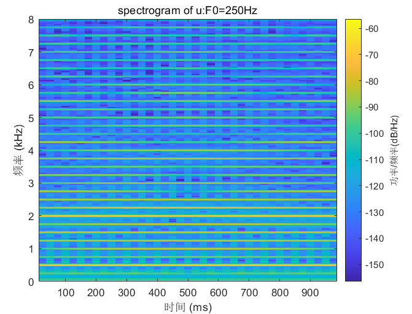 
</center
<div align = 'center'><b>Fig.4 the Spectrograms of three synthesized vowels</div>	

​	From the above figures, what is obvious is that the spectrogram of the synthesized speech is very regular, and the distribution of peaks looks good. However, the speech is very stiff, which sounds like very mechanical. 

### 2.2 probelm2

​	In probelm2, we hear the test on-line and generate our own equal loudness contour. We start with the relatively middle value for $1$kHz and find the equal loudness to right and left.	

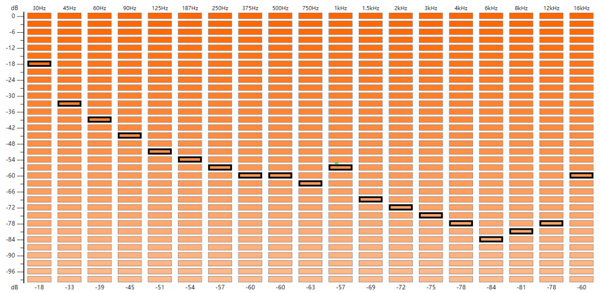

<div align = 'center'><b>Fig.5 equal loudness contour</div>

​	From the above picture, what can be seen is that there is a local peak near the frequency of $1$kHz, and the curve decreases from $30$Hz to $750$Hz and from $1.5$kHz to $4$kHz.

​	According to relevant materials, most people's hearing is most sensitive around $1-4$ kHz and less sensitive at high and low frequencies. This can be shown in the curve.

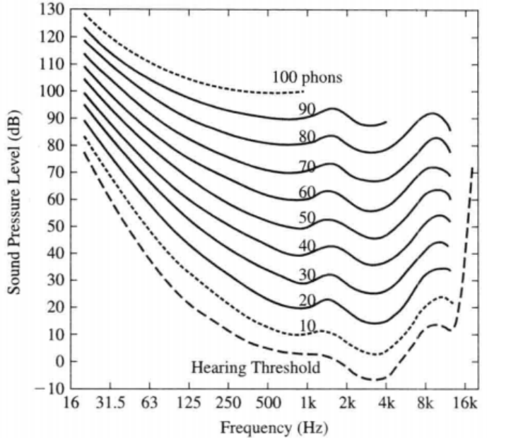

<div align = 'center'><b>Fig.6 curves for pure tones</div>

​	The high frequency hearing of adults depends on age and exposure to loud sounds.  

### 2.3 problem3

​	The task of the problem3 is to generate noisy speech by white noise at $5$ and $0$ dB $SNR$ and equalize the energy of noisy speech to that of clean speech.

​	The formula of $SNR$ is:
$$
SNR=10log_{10}\frac{E_{signal}}{E_{noise}}
$$
​	  A function named `y=awgn(x,snr,signalpower)` is very convenient to generate noisy speech by white noise at specified $SNR$.\

​	`y` : the output signal with white noise

​	`x`: the input signal

​	`snr`: the value is in $dB$, which is $10log_{10}\frac{E_{signal}}{E_{noise}}$

​	`signalpower`: always specify `signalpower` as `measured` to have the function measure the power of `x` before adding noise.

​	Then we equalize the energy of noisy speech to that of clean speech.

```matlab
[s,fs]=audioread('mhint_01_01.wav');
y_5=awgn(s,5,'measured');
y_0=awgn(s,0,'measured');
equalize_y_5=y_5/norm(y_5)*norm(s);
equalize_y_0=y_0/norm(y_0)*norm(s);
```

​	The waveforms and spectra of clean speech and noisy speech at $5$ and $0$ $dB$ $SNR$ is as shown in `Fig 7`.

<center class="half">    
    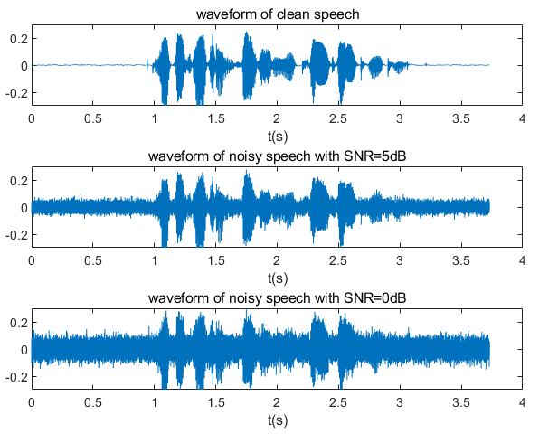    
    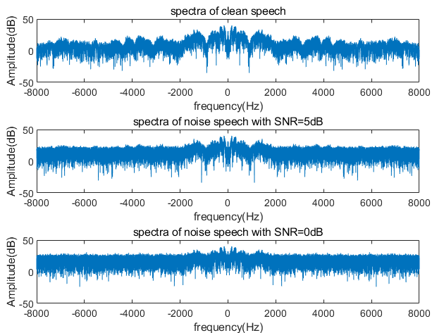 
</center

<div align = 'center'><b>Fig.7 the waveform and spectra of clean speech, noisy speech with 5 and 0 dB SNR</div>	

​	Compared with waveform of clean speech, it is clear to see that there are much noise at the where the amplitude of the original signal is very weak. Besides, with $SNR$ increasing,  the amplitude of noise at those places are decreasing. From the spectra of clean speech, the change of amplitude in frequency domain is quite obvious and the largest part of the amplitude is near zero frequency. With $SNR$ decreasing, amplitude is flatter and flatter and the largest part of the amplitude is no longer prominent.

​	The spectrograms of clean speech and noisy speech at $5$ and $0$ $dB$ $SNR$ is as shown in `Fig 8`.

<center class="half">    
    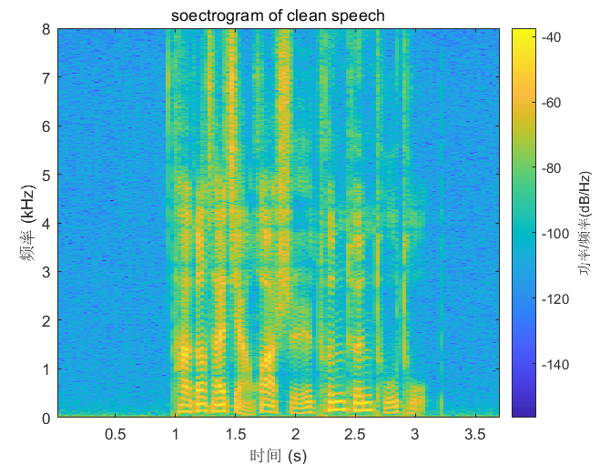    
    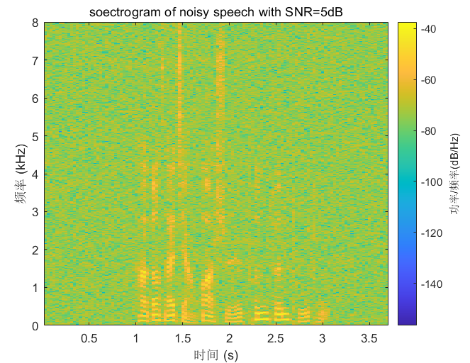 
</center

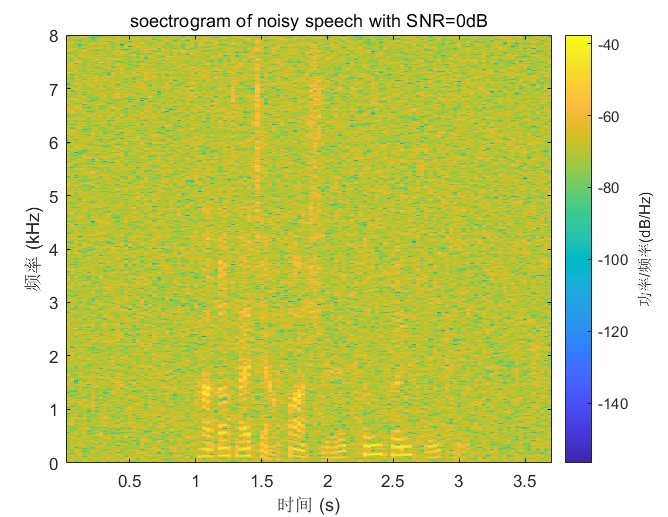

<div align = 'center'><b>Fig.8 the spectrograms of clean speech, noisy speech with 5 and 0 dB SNR</div>		

​	From the spectrograms of clean speech, it is obvious that the yellow part near the middle is the clean speech and the blue part near the edge is the silence. Compared with that, the silence part in noisy speech is occupied by noise. What's more, with $SNR$ decreasing, the less visible the clean speech is in the spectrogram. 

### 2.4 problem4

​		The purpose of problem4 is to generate more noisy speech to do objective speech quality evaluation. The operation is similar with problem3, using function `awgn` to generate noisy speeches and equalizing the energy of noisy speech to that of clean speech.

​	The plot of the PESQ value as a function of $SNR$ level is as shown in `Fig 9`.

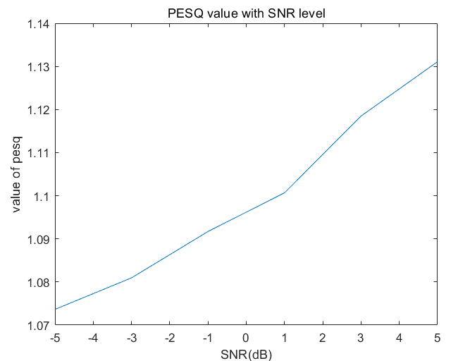

<div align = 'center'><b>Fig.9 PESQ value as a function of SNR level</div>

​	The higher the $SNR$, the higher the PESQ value of noisy speech, which coincides with the theory. The reason is that the speech with higher SNR will have greater pure signal energy and less noise energy, so the sound quality is better and we can hear the message more clearly. 

## 3. Conclusion

​	This experiment shows how to use MATLAB simulation for speech analysis. MATLAB is convenient to synthesize vowels from tones and analyze the result in time domain waveforms, frequency domain spectra and spectrograms. The most harvest in this experiment is the effect on the spectrogram caused by SNR. The larger the SNR, the less able it is to mask the original signal in the spectrogram, which makes the PESQ value larger.