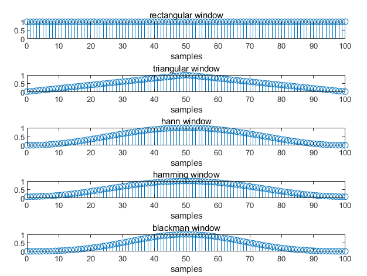

<h1 align = "center">Lab4 Time-Domain Methods for Speech Processing</h1>

<center>张旭东 12011923</center>

## 1. Introduction

​	In this experiment, the main purpose is an in-depth study of short time speech analysis in time domain. We will learn the windowing effect for short-time speech analysis, which allows us to separate the useful part from the useless noise and get useful information. Different types of windows, lengths and overlapping have different effect for short time analysis. What's more, how to analyze speech signal with short-time energy, magnitude and zero-crossing will be discussed in time domain.

## 2. lab result and analysis

### 2.1 problem1

​	In probelm1, what require us to do is to plot the time and frequency responses of five different $L$-point windows, including Rectangular window, Triangular window, Hann window, Hamming window and Blackman window. Besides, compare the effective bandwidths of the five windows along with the peak sidelobe ripple(in $dB$).

​	Rectangular window:
$$
w[n]=   \left\{ \begin{array}{rcl}
1 & 0\leqslant n \leqslant L-1 \\
0 & otherwise
\end{array}\right.
$$
​	Triangular window:
$$
w[n]=   \left\{ \begin{array}{rcl}
\frac{2n}{L-1} & 0\leqslant n \leqslant \frac{L-1}{2} \\
2-2\frac{2n}{L-1} & \frac{L+1}{2} \leqslant n \leqslant L-1\\
0 & otherwise
\end{array}\right.
$$
​	Hann window:
$$
w[n]=   \left\{ \begin{array}{rcl}
0.5-0.5cos(\frac{2\pi n}{L-1}) & 0\leqslant n \leqslant L-1 \\
0 & otherwise
\end{array}\right.
$$
​	Hamming window:
$$
w[n]=   \left\{ \begin{array}{rcl}
0.54-0.46cos(\frac{2\pi n}{L-1}) & 0\leqslant n \leqslant L-1 \\
0 & otherwise
\end{array}\right.
$$
​	Blackman window:
$$
w[n]=   \left\{ \begin{array}{rcl}
0.42-0.5cos(\frac{2\pi n}{L-1})+0.08cos(\frac{4\pi n}{L-1}) & 0\leqslant n \leqslant L-1 \\
0 & otherwise
\end{array}\right.
$$
​	The MATLAB provides functions `rectwin(L)`, `triang(L)`, `hann(L)`, `hamming(L)` to generate the above windows. In this experiment, the length of window is $101$. The time responses  and log magnitude responses of all five windows are as `Fig1` and `Fig2`.



<div align = 'center'><b>Fig.1 the time responses of all five windows</div>


<div align = 'center'><b>Fig.2 the log magnitude responses of all five windows</div>

​	To compare the effective bandwidths of the five windows along with the peak sidelobe ripple (in $dB$), we replot the log magnitude response over a narrow band between $0$ and $5*F_{s}/L$ to compare the effective bandwidths of the five windows. The result is as `Fig3`.


<div align = 'center'><b>Fig.3 the log magnitude responses between 0 and 5*2/L</div>

​	The definition of effective bandwidths is the bandwidth where the amplitude is not smaller than $3dB$ and the definition of peak sidelobe ripple is the maximum value after the first minimum. So, let's zoom in to find out roughly. The result is as the following table.

​	

| window      | bandwidth(rad/s) | peak sidelobe ripple(db) |
| ----------- | ---------------- | ------------------------ |
| Rectangular | 0.1335           | -13.1951                 |
| Triangular  | 0.2025           | -25.9323                 |
| Hann        | 0.2270           | -31.4769                 |
| Hamming     | 0.2010           | -41.4299                 |
| Blackman    | 0.2592           | -58.2574                 |

​	From the above table, it is obvious that Rectangular window has the smallest bandwidth and the smallest magnitude of peak sidelobe ripple while the Blackman window has the largest bandwidth and the largest magnitude of peak sidelobe ripple among the five windows. What's more, other properties of  Rectangular window, Hann window, Hamming window and Blackman window are as `Fig4` according to the knowledge of digital signal processing.


<div align = 'center'><b>Fig.4 properties of fixed windows</div>

​	$M$ is the number of points of $DFT$. When $M$ is fixed, Rectangular window has the smallest main lobe width, relative sidelobe level, minimum stopband attenuation and transition bandwidth while Blackman-Harris has the largest main lobe width, relative sidelobe level, minimum stopband attenuation and transition bandwidth. The larger the relative value of the sidelobe, the stronger the acromial and ripple fluctuations near the sides of the transition zone.

### 2.2 problem2

​	The problem2 require us to write a MATLAB program to analyze a speech file with its waveform, short-time energy, short-time magnitude and short-tine zero-crossing. 

​	The sample rate of the speech file `s5.wav` is 80KHz and the speech file is a male sound. According to measurement information, the basic frequency of male sound is $80$Hz. The window sizes should be larger than a pitch period and not larger than ten times pitch period. If $L$ is too small, the difference between the results of two adjacent operations will be very large and if $L$ is too large, result will change very slowly, which will not adequately reflect the changing characteristics of speech signals. So, L should be larger than $8000/80=100$ samples. $L=201$ is suitable.

​	For the value of window shift $R$, it is typically computed with window overlap of $50$% to $70$% ($R=\frac{L}{4}$ to $R=\frac{L}{2}$). We will compare the results with $R=\frac{L}{4}$ with that $R=\frac{L}{2}$ later.

​	For the type of window, we choose Rectangular window because the minimum stopband attenuation and transition bandwidth of Rectangular window are smaller than that of Hamming window, which can reduce the ripple fluctuations near the sides of the transition zone.

​	The  steps and formulas for computing the short-time energy $E_{\hat{n}}$, the short-time magnitude $M_{\hat{n}}$ and the short-time zero-crossing $Z_{\hat{n}}$ are as follows:

​	The short-time energy $E_{\hat{n}}$:


$$
E_{\hat{n}}=\sum^{\infin}_{-\infin}(x[m]w[\hat{n}-m])^{2}=\sum^{\infin}_{-\infin}(x[m])^{2}\tilde{w}[\hat{n}-m]
$$
​	The short-time magnitude $M_{\hat{n}}$ :


$$
M_{\hat{n}}=\sum^{\infin}_{-\infin}|x[m]w[\hat{n}-m]|=\sum^{\infin}_{-\infin}|x[m]|\tilde{w}[\hat{n}-m]
$$
​	The short-time zero-crossing $Z_{\hat{n}}$ :


$$
Z_{\hat{n}}=\frac{1}{2L_{eff}}\sum^{\infin}_{-\infin}|sgn(x[m])-sgn(x[m-1])|\tilde{w}[\hat{n}-m]
$$
​	The function code is as below:

```matlab
function [E,M,Z]=EMZ(s,L,R,window)
        N=length(s);
        N_E=floor(N/R);
        
        E=zeros(1,N_E);
        for n=1:floor((N-L)/R)
            for m=1:L
                E(n)=E(n)+s(m+(n-1)*R)^2*window(m);
            end
        end
        
        M=zeros(1,N_E);
        for n=1:floor((N-L)/R)
            for m=1:L
                M(n)=M(n)+abs(s(m+(n-1)*R))*window(m);
            end
        end
        
        sign=zeros(1,N);
        for i=1:N
            if s(i)>=0
                sign(i)=1;
            else
                sign(i)=-1;
            end
        end
        
        Z=zeros(1,N_E);
        for n=1:floor((N-L)/R)
            for m=2:L
                Z(n)=Z(n)+(abs(sign(m+R*(n-1))-sign(m-1+R*(n-1))))*window(m)/(2*L);
            end
        end      
end
```

​	Using this function, the result is generated with $L=201，R=50$ and Rectangular window, which is as `Fig 5`.


<div align = 'center'><b>Fig.5 waveform,short-time energy, short-time magnitude and short-time zero-crossing for L=201,R=50 and Rectangular window</div>

​	Comparing the short-time energy with the short-time magnitude, it is clear that the two waveforms are basically the same, except the amplitude is different. This is because the operation of the short-time energy is square which can increases the difference between larger and small values in the original speech signal. 

​	What's more, the information part and noise part can be distinguished according to the short-time energy , the short-time magnitude and the short-time  zero-crossing. The mean of  Gaussian noise is $0$ and the amplitude of it is always less than $1$. After squaring, the most part of energy is less than $1$. Based on this and comparing the short-time energy and the short-time magnitude, the information part and noise part can be distinguished. What's more,  the zero-crossing rate of noise is obviously larger. For the useful information, the speech is generally periodic and the zero-crossing rate is low.

<center class="half">    
        
     
</center

<div align = 'center'><b>Fig.6 Rectangular R=L/4(left) and Rectangular R=L/2(right)</div>

<center class="half">    
        
     
</center

<div align = 'center'><b>Fig.7 Hamming R=L/4(left) and Hamming R=L/2(right)</div>

​	Comparing the figure of Rectangular, R=L/4 with that of Rectangular, R=L/2, it is obvious that there are more fluctuations at the peak in the energy and magnitude in the former while the shape of the latter is more smooth. R=L/4 can generate more details. Besides, comparing the figure of Rectangular, R=L/2 with that of Hamming, R=L/2, it is obvious that the former can generate more details.

###  2.3 problem3

​	The problem3 requires us to write a MATLAB program to show the effects of window duration on the short-time analysis of energy, magnitude, and zero-crossing. The operation we do is similar to problem2 with window size $L=51,101,201,401$. In this problem, we choose the window shift $R=L/4$.

​	The results using Rectangular window and Hamming window are in `Fig 8` and `Fig9`.


<div align = 'center'><b>Fig.8 waveform,short-time energy, short-time magnitude and short-time zero-crossing for different window size with Rectangular window</div>


<div align = 'center'><b>Fig.8 waveform,short-time energy, short-time magnitude and short-time zero-crossing for different window size with Hamming window</div>

​	From the figures of the short-time energy and the short-time magnitude, it is obvious that with the window size increasing, the amplitude of magnitude and energy also increase. This is because the longer window contains a wider range of samples. According to `Formula (6) and (7)`, the amplitude of energy and magnitude becomes larger. Besides, the larger window size magnifies the difference between the maximum value and the minimum value in the signal. What's more, the general trend of zero-crossing curve for different window size is the same. With the window size increasing, the zero-crossing curve becomes more smooth.

## 3. conclusion

​	The experiment was divided into two main parts.

​	The first part is to explore the characteristics of five window functions, including Rectangular window, Triangular window, Hann window, Hamming window and Blackman window. In the actual speech signal processing process, it is necessary to select the appropriate window function according to the actual situation and the characteristics of the window function.

​	The second part is to explore the effects of window duration on the short-time analysis of energy, magnitude, and zero-crossing. The window sizes should be larger than a pitch period and not larger than ten times pitch period. If $L$ is too small, the difference between the results of two adjacent operations will be very large and if $L$ is too large, result will change very slowly, which will not adequately reflect the changing characteristics of speech signals. In reality, a compromise and an appropriate window size are need to be found to maximize the extraction of waveform information.