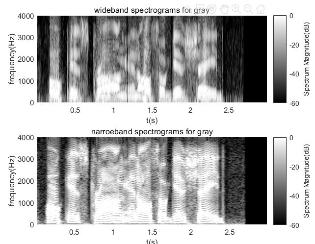
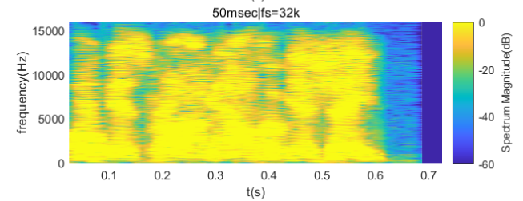

<h1 align = "center">Lab5 Frequency-Domain Representations</h1>

<center>张旭东 12011923</center>

## 1.Introduction

​	The experiment is to analyze the problem in the frequency-domain. Similar to the time-domain analysis in last lab, windows is used to extract partial signal for short-time analysis. After that, DTFT is used to achieve STFT. Lengths and types of windows have an effect on short-time frequency analysis and spectrogram. The purpose of this lab is to analyze speech signal with short-time frequency analysis and spectrogram and learn the windowing effect for short-time frequency analysis. 

## 2.Lab result and analysis

### 2.1 problem1

​	The requirement of problem1 is to write a MATLAB program to perform short-time analysis on a single frame of the speech waveform. The program is named as `STSA_SingleFrame`, whose code is as below:

```matlab
function [waveform,t,frame,frame_t,magnitude,magnitude_w]=STSA_SingleFrame(filename,startsmp,framelength)
        [waveform,fs]=audioread(filename);
        t=0:1/fs:(length(waveform)-1)/fs;
        numberofsample=framelength/1000*fs;
        frame=zeros(1,numberofsample);
        frame_t=(startsmp-1)/fs:1/fs:(startsmp+numberofsample-2)/fs;
        ham=hamming(numberofsample)';
        for i=1:numberofsample
            frame(i)=waveform(startsmp+i-1)*ham(i);
        end
        x=fftshift(fft(frame));
        magnitude=abs(x);
        w=-pi:2*pi/(length(x)-1):pi;
        magnitude_w=w*fs/2/pi;
end
```

​	The input of the function is `filename`, `startsmp` and `framelength`. I have to convert from the input frame length in `msec` to the frame length in samples based on the sampling rate of the digital speech signal being analyzed. So the number of samples is:
$$
N=\frac{framelength}{1000}f_{s}
$$
​	$f_{s}$ is the sampling rate of the digital speech signal being analyzed. The appropriate length of a Hamming window is $N$. The selected frame of the speech is:
$$
\sum x(m)w(\hat n-m )
$$
​	The formula of STFT is:
$$
X_{\hat n}(e^{j\omega})=\sum^{\infin}_{m=-\infin}x(m)w(\hat n-m)e^{-j\omega m}
$$
​	According to `formula 3`, $X_{\hat n}(e^{j \omega})$ is the result of DFT of $x(m)w(n-m)$. So, we use FFT function to achieve the STFT of the selected frame of speech.  For the main program, we just use the function above and input the parameters.

```matlab
[waveform1,t1,frame1,frame_t1,magnitude1,magnitude_w1]=STSA_SingleFrame('s5.wav',7000,40);
[waveform2,t2,frame2,frame_t2,magnitude2,magnitude_w2]=STSA_SingleFrame('vowel_iy_100hz.wav',1000,40);
```

The results are in `Fig1` and `Fig2`.


<div align = 'center'><b>Fig.1 result of s5.wav</div>


<div align = 'center'><b>Fig.2 result of vowel_iy_100hz.wav</div>

​	From `Fig1`, the selected frame is a vocal segment based on the original waveform. The amplitude of the segment is a little reduced after the operation of the Hamming window. From the magnitude of the STFT of the selected frame, the energy is mainly distributed in the low frequency band. The amplitude is relatively large and implies the energy is relatively strong, which indicates the selected frame contains useful information.

​	From `Fig2`, the selected frame is a noise segment based on the original waveform. From the magnitude of the STFT of the selected frame, the energy is mainly distributed in the low frequency band. However, the amplitude is relatively small and the energy is weak, which indicates the selected frame contains useless information.

### 2.2problem2

​	The requirement of problem2 is to write a MATLAB program to perform (and compare the results of) multiple short-time analysis of a section of speech using multiple window lengths. The code of the  function named `STSA_	MultiLengths` is as below, whose input is the number of short-time spectral analyses of be compared, the speech filename, the starting sample within the speech array for analysis of the short-time spectrum and the frame lengths in `msec` for each of the multiple analyses.

```matlab
function [waveform,t,ham_matrix,frames_ham,frames_ham_t,magnitude_ham,magnitude_ham_w]=STSA_MultiLengths(num,filename,startsmp,framelengths)
            [waveform,fs]=audioread(filename);
            t=0:1/fs:(length(waveform)-1)/fs;
            
            numberofsamples=zeros(1,num);
            
            ham_matrix=zeros(1,sum(framelengths)/1000*fs);
            frames_ham=zeros(1,sum(framelengths)/1000*fs);
            frames_ham_t=zeros(1,sum(framelengths)/1000*fs);
            magnitude_ham=zeros(1,sum(framelengths)/1000*fs);
            magnitude_ham_w=zeros(1,sum(framelengths)/1000*fs);
            
            sum_num=0;
            for i=1:num
                numberofsamples(i)=framelengths(i)/1000*fs;
                
                ham_matrix(sum_num+1:sum_num+numberofsamples(i))=hamming(numberofsamples(i))';
                transpose_waveform=waveform';
                temp=transpose_waveform(startsmp:startsmp+numberofsamples(i)-1);
                frames_ham(sum_num+1:sum_num+numberofsamples(i))=temp;
                frames_ham_t(sum_num+1:sum_num+numberofsamples(i))=(startsmp-1)/fs:1/fs:(startsmp+numberofsamples(i)-2)/fs;
                x=fftshift(fft(frames_ham(sum_num+1:sum_num+numberofsamples(i)).*ham_matrix(sum_num+1:sum_num+numberofsamples(i))));
                magnitude_ham(sum_num+1:sum_num+numberofsamples(i))=abs(x);
                w=-pi:2*pi/(length(x)-1):pi;
                magnitude_ham_w(sum_num+1:sum_num+numberofsamples(i))=w*fs/2/pi;
                
                sum_num=sum_num+numberofsamples(i);
                
            end
            %numberofsamples=framelength/1000*fs;
            %frame_t=(startsmp-1)/fs:1/fs:(startsmp-1+framelength)/fs
end
```

​	Five arrays, including ham_matrix, frame_ham, frames_ham_t, magnitude_ham and magnitude_ham_w are created to store the corresponding values. Other operation is similar to that in problem1.   

​	For the main program, we just use the function above and input the parameters.

```matlab
framelengths=[5 10 20 40];
[waveform,fs]=audioread('s5.wav');
[waveform,t,ham_matrix,frames_ham,frames_ham_t,magnitude_ham,magnitude_ham_w]=STSA_MultiLengths(4,'s5.wav',7000,framelengths);
[waveform2,t2,rectangular_matrix,frames_rectangular,frames_rectangular_t,magnitude_rectangular,magnitude_rectangular_w]=STSA_MultiLengths2(4,'s5.wav',7000,framelengths);
```

​	The results using Hamming window and rectangular window are in `Fig3` and `Fig4`.


<div align = 'center'><b>Fig.3 result using Hamming window</div>


<div align = 'center'><b>Fig.4 result using rectangular window</div>

​	For the amplitude of STFT, the frequency distributions of different window lengths is similar and the general trend of envelope is the same. However, with the lengths of window increasing, the overall amplitude of the magnitude of STFT of the selected frame increases. The overall amplitude and fluctuation of `40msec` is the largest, showing more detailed information in frequency domain than others. Besides, with the lengths of window increasing, fluctuations in the spectrum are becoming more pronounced. The spectrum of the selected frame whose length of window is `40msec` has the largest fluctuation among the four spectrum while that of selected frame whose length of window is `5msec` is the most smooth and flattest among the four.

​	Comparing the results using Hamming window and rectangular window, it is obvious that the amplitude of spectral using Hamming window is smaller than that of spectral using Rectangular window because the value of rectangular window in time domain is $1$ while that of Hamming window in time domain is not greater than $1$. 

### 2.3problem3

​	The requirement of problem3 is to write a program to create digital spectrograms(both narrowband and wideband spectrograms) from a specified speech file. The input of the program is the speech filename, resampling rate, window length, FFT length, log or linear magnitude of the short-time spectra, dynamic range and the color.  The window used in this problem is Hamming window and the window shift is $\frac{L}{4}$.

​	The MATLAB code is as below:

```matlab
function []=STSA_Spectrograms(filename,resamplerate,windowlengths,FFTlengths,magscale,range,color)
    [waveform,fs]=audioread(filename);
    
    if resamplerate~=0
        [p,q]=rat(resamplerate,fs);
        waveform=resample(waveform,p,q);
        fs=resamplerate;
    end
    numberofsample=windowlengths/1000*fs;
    ham=hamming(numberofsample)';
    
    [s,w,t]=spectrogram(waveform,ham,numberofsample*0.75,FFTlengths,fs,'yaxis');
    if magscale=='log'
        pcolor(t,w,20*log10(abs(s)));
        shading interp;
        c=colorbar;
        if range==0
            c.Label.String='Spectrum Magnitude(dB)';
        else
            caxis([-60 -60+range]);
            c.Label.String='Spectrum Magnitude(dB)';
        end
        
    else
        pcolor(t,w,abs(s));
        shading interp;
        c=colorbar;
        c.Label.String='Spectrum Magnitude';
    end
    
    if color=='gray'
        colormap('gray');
    else
    end
end
```

​	Then, we test our program with the following inputs `STSA_Spectrograms('s5.wav',0,5,1024,'log',60,'c')`, and the results are in `Fig 5`.

<center class="half">    
        
     
</center

<div align = 'center'><b>Fig.5 wideband and narrowband spectrogram </div>

​	From the figure, it is easy to distinguish the noise segment and vocal segment. The energy of vocal segment is concentrated and brighter in the color spectrum. In some frequency regions, the brightness in the figure is very large, and these regions are formant frequency. Formants vary over time because the speech file emits different phonemes over time. When the lengths of window increases and the spectrogram becomes narrowband spectrogram, the horizontal line on the narrow-band is more obvious. This validates what we learned in the theory class. The time resolution of wideband is high while the frequency resolution of narrowband is high.

​	Then, we use different sampling rate and analyze the result:

<center class="half">    
        
     
</center

<center class="half">    
        
     
</center

<div align = 'center'><b>Fig.6 narrowband spectrogram with different sampling rate </div>

​	From the figures above, it is obvious that with the resampling rate increasing, the time scale decreases and the frequency scale increases. Besides, with the resampling rate increasing, the transition in the spectrogram is more nature and continuous and the spectrogram is more vague.

​	Using the narrowband result, we change the color, resampling rate, FFT size, amplitude range and scale in the amplitude.

<center class="half">    
        
     
</center

<center class="half">    
        
     
</center

<center class="half">    
        
     
</center

<div align = 'center'><b>Fig.7 narrowband spectrogram with different parameters </div>

​	Gray color: The frequency formant is easily to be found because of the high contrast ratio in the gray color result.

​	FFT length: From the figure, there is little difference between the result of `FFTlength=1024` and that of `FFTlength=4096`.

​	Range: When we increase the magnitude range to $100$ dB, the energy contained is less and the formant frequency is hard to find again.

​	Linear magnitude: It is hard to see the spectrogram using linear magnitude. That is because the log operation can enlarge the difference.			

## 3.Conclusion

​	The main harvest in this lab is to learn how to analyze the speech signal with short-time frequency analysis or spectrogram and the windowing effect for short-time frequency analysis. What's more, the influence of window length and other parameters, including scale, range,color and `FFTlength` have been discussed detailed. 