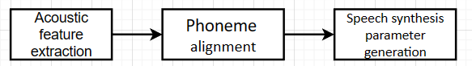

<h1 align = "center">Text-to-Speech based on pyttsx3</h1>

廖子涵 12010615 耿沛言 12012941  张旭东 12011923 

## 1. Background(耿沛言)

## 2. Implementation

### 2.1 Theoretical introduction

​	Text to speech consists of two parts, including speech synthesis and signal processing. Speech synthesis is the process of converting text into speech. Its goal is to generate natural, smooth speech output that sounds like real human speech. And speech signal processing includes acoustic feature extraction, phoneme alignment, speech synthesis parameter generation and so on.

#### 2.1.1 Speech synthesis

​	Speech synthesis can be implemented using rule-based, statistics-based or deep learning-based methods.

- Rule- based method

  Rule-based speech synthesis methods synthesize speech using a library of predefined speech rules and speech units. These rules are created based on phonetics knowledge and acoustic models. For example, a vocal tract model can describe how sound travels and deforms in the throat, mouth, and nasal cavity. Rule-based approaches require a large number of artificial rules and acoustic models, so there may be limitations in terms of flexibility and naturalness.

- Statistic-based method

  Statistically based speech synthesis methods use large-scale speech data sets to train models and use these models to generate speech. Common statistical methods include Hidden Markov Models (HMM) and Gaussian Mixture Models (GMM). These models capture the statistical characteristics and conversion rules of speech. For example, in HMM, text is converted into a series of phonemes, and the acoustic characteristics of each phoneme are then predicted by a model to generate a corresponding speech output.

- deep-learning-based methods

  Deep learning methods have made remarkable progress in speech synthesis. They use deep neural networks to learn the representation and generation patterns of speech. Recurrent Neural Networks (RNNS) and their variants (such as Long Term Memory networks, Long Term memory, and LSTM) are commonly used deep learning architectures for modeling mapping relationships between text and speech. These models are capable of learning complex speech patterns and relationships between phonemes to produce a more natural, fluid speech output.

#### 2.1.2 Signal processing

<b>Fig steps of signal processing 

​	The steps of signal processing include acoustic feature extraction, phoneme alignment and speech synthesis parameter generation.

- Acoustic feature extraction

  Acoustic feature extraction is the process of extracting sound features from speech signals. These features are used to describe the time-domain and frequency-domain characteristics of sound. Common acoustic features include pitch, formant frequencies, and Mel-frequency Cepstral Coefficients (MFCCs). These features play an important role in speech synthesis because they capture key features of speech signals.

- Phoneme alignment

  Phoneme alignment is the process of aligning input text with phonemes. In speech synthesis, text is usually converted into a sequence of phonemes, each representing a basic unit in speech. The purpose of phoneme alignment is to determine the duration and position of each phoneme in order to accurately control the synthesis of phonemes during the stage of speech synthesis parameter generation.

- Speech synthesis parameter generation

  In the stage of speech synthesis parameter generation, the parameter sequence for synthesizing speech is generated based on the input text and aligned phonemes. These parameters describe characteristics, such as the length, frequency and intensity of the sound. The generated parameter sequence can include fundamental frequency, formant frequency, volume, tone, and so on. These parameters are typically used by speech synthesis engines to generate a final speech output from the input text.

### 2.2 Common text-to-speech library

​	There are five common text-to-speech libraries, including `pyttsx3`, `Google Text-to-Speech`, `pyttsx`, `espeak` and `Festival`. 

- pyttsx3

  **Advantage:** Not only is it cross-platform and can run on multiple operating systems, it is also simple to use and provides an intuitive interface. At the same time, it supports the setting of multiple languages and voice properties, and also provides some advanced functions, such as setting voice, obtaining voice list and saving voice as audio files. 

  **Disadvantage:** Calling it on some operating systems may require additional configuration and dependencies. Also, support for some specific languages and accents may be limited.

- Google Text-to-Speech

  **Advantage:** Based on the Google Text-to-Speech API, it provides high-quality speech synthesis, supports customization of multiple languages and speech properties, and also allows speech to be saved directly as audio files.

  **Disadvantage:** It requires networking to use and relies heavily on the Google Text-to-Speech API. Also, it may be slow to convert when dealing with large amounts of text.

- pyttsx

  **Advantage:** It is cross-platform, can run on multiple operating systems, and also provides similar interfaces and features to `pyttsx3`.

  **Disadvantage:** The library is no longer actively maintained and may not have the latest features and improvements.

- espeak

  **Advantage:** This library is open source and cross-platform, and can run on multiple operating systems. It supports multiple languages and phoneme libraries, and also provides command-line tools and API interfaces.

  **Disadvantage:** It may have limited pronunciation accuracy and naturalness for some languages, and does not guarantee the quality of the text conversion.

- Festival

  **Advantage:** This library is not only open source and cross-platform and can run on multiple operating systems, but also provides a variety of speech synthesis methods and algorithms to choose from.

  **Disadvantage:** It requires additional configuration and setup and is relatively complex to use. Support for some languages and accents may be limited.

​	Each library has its own advantages and disadvantages. Choosing the right library should be balanced according to specific needs, platform requirements, and speech synthesis quality.

​	The library used in this project is `pyttsx3`.

#### Introduction to pyttsx3

​	Pyttsx3 is a Python library for text-to-speech conversion that provides a simple yet powerful interface for speech synthesis on multiple platforms. Here are some of the features and functions of `pyttsx3`.

- **Cross-platform support:** Pyttsx3 can run on multiple operating systems, including Windows, Mac, and Linux. This makes it a universal text-to-speech solution.
- **Multilanguage support:** Pyttsx3 supports speech synthesis in multiple languages, including English, Spanish, French, German, Italian, Portuguese, and more. The appropriate language can be selected according to the requirement for speech synthesis.
- **Customizable voice properties:** Pyttsx3 allows to customize the synthesized speech output by setting the properties of the speech. The desired speech effect can be gotten by adjusting the speed, pitch, volume, and other attributes of speech.
- **Event-driven architecture:** Pyttsx3 uses an event-driven architecture that can handle various events of speech synthesis, such as starting synthesis, updating synthesis progress, and completion of synthesis. These events can be listened by registering event handlers and take appropriate actions as needed.
- **Multi-engine support**: Pyttsx3 supports multiple speech synthesis engines. It uses either `SAPI5` or `NSSpeechSynthesizer` by default, but can also choose other available engines such as `eSpeak`, Microsoft Speech Platform, or other third-party engines on demand.
- **Advanced function:** Pyttsx3 provides a number of advanced features to enhance the flexibility and functionality of speech synthesis. This includes getting a list of available voices, setting up specific voices, saving the voice as an audio file, and more.

### 2.3 Implementation detail(廖子涵)

### 2.4 Result and analysis(耿沛言)

## 3. Future improvement and new application

### 3.1 Improvement

​	When text-to-speech is performed, the following can help improve the quality and naturalness of speech synthesis.

1. **Control speed and pitch:** 

   By adjusting speed and pitch, the speech sound more natural. Appropriate speech speed and pitch can increase the intelligibility and fluency of speech. The best combination of speed and pitch for a particular application can be found by experimenting with different settings.

2. **Expression of emphasis and tone:**

   Where appropriate, emphasize specific words or express specific emotions by using different tones, volumes, and tones. This can make the speech sound more vivid and expressive.

3. **The accuracy and coherence of phonemes:**

   Ensure that the speech synthesis engine can accurately recognize and synthesize different phonemes.The accuracy of phonemes is very important for correct pronunciation and intelligibility of speech. In addition, make sure that transitions and connections between phonemes are smooth and natural to avoid intermittent or disconnected speech output.

4. **Focus on specific languages and accents:**

   If an application scenario involves a specific language or accent, it is advised to select a speech synthesis engine that supports the language or accent. Different languages and accents have their own unique pronunciation rules and acoustic characteristics, and choosing the right engine can provide more accurate and natural speech output.

5. **Introducing the latest technology in the field of speech synthesis:**

   Keep abreast of the latest technology and research advances in speech synthesis, such as the application of deep learning and neural networks, as well as methods for training using large data sets. These technologies can provide higher quality, more natural speech synthesis effects.

6. **Feedback and evaluation of user:**

   Through feedback and evaluation of user, the performance of the speech synthesis system in different application scenarios can be understood. User's feedback can help identify problems, improve the system, and meet user's requirements.

​	Different application scenarios may have different requirements for speech synthesis. Therefore, according to the specific requirements, the appropriate parameters are set and adjusted to achieve the best text-to-speech experience.

### 3.2 New application

​	In the future, text-to-speech technology has a wide range of application prospects. Here are some possible future applications.

1. **Personalized assistants and avatars:**

   Text-to-speech gives voice and voice interaction to personalized assistants and avatars. This makes the assistants and characters more vivid and intimate, providing a more natural conversational experience. For example, avatars in smart speakers, smartphones, and virtual reality applications can communicate and interact with users through text-to-speech technology.

2. **Voice-assisted technology:**

   Text-to-speech plays an important role in assisting the visually impaired and the speech impaired. Future applications could help these populations better interact with their digital and physical environments by converting text to speech, providing real-time screen reading, voice prompts, and voice navigation.

3. **Multilingual and interlingual communication:**

   Text-to-speech technology has potential in multilingual and cross-lingual communication. It can convert text to speech in real time and provide speech translation capabilities that support different languages. This can promote communication and understanding between different languages and broaden communication channels in the era of globalization.

4. **Media and entertainment experiences:**

   Text-to-speech can improve the media and entertainment experience. For example, in the realm of e-book readers and audiobooks, text-to-speech can convert book content into audio playback. In addition, in games and virtual reality, text-to-speech technology can empower characters and virtual worlds with voice and interaction capabilities, providing a more immersive and immersive experience.

5. **Customize broadcast and media content:**

   Text-to-speech can be used for customized broadcast and media content generation. By converting text to speech, users can be provided with personalized content such as news, podcasts, audio books, and radio shows.

​	With the continuous development and innovation of technology, text-to-speech technology will further expand the application field and provide more personalized, immersive and convenient voice interaction experience.